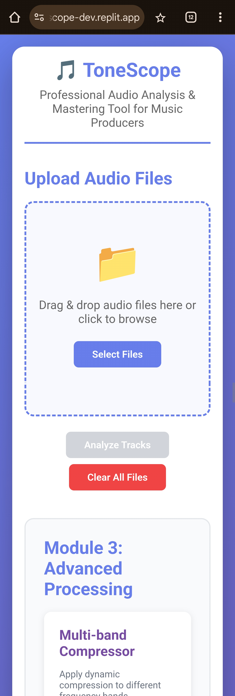

# ToneScope - Audio Analysis & Mastering Tool



**ToneScope** is a professional, web-based audio analysis and mastering tool designed for music producers, audio engineers, and hobbyists. It provides a comprehensive suite of tools to analyze and process audio files, helping you achieve a polished and professional sound.

## 🌐 Live Demo

Check out the live version of ToneScope here: [https://tone-scope-dev.replit.app/](https://tone-scope-dev.replit.app/)

## ✨ Features

### Module 1: Analyzer
*   **Tonal Balance Analysis:** Visualize the frequency spectrum of your tracks with an overlaid chart, making it easy to identify and correct tonal imbalances across an album or a collection of songs.
*   **Dynamic Range Metering:** Get precise measurements of LUFS, True Peak, and Crest Factor for each track to ensure your audio complies with loudness standards and has a healthy dynamic range.
*   **Stereo Image Inspection:** Analyze the stereo width and L/R correlation of your tracks to ensure a wide, yet mono-compatible, stereo image.

### Module 2: Tonal Palette
*   **One-Click Presets:** Instantly apply one of the four mastering presets to audition different tonal characters for your tracks:
    *   **✨ Brighter:** Adds a high-frequency boost for a modern, airy sound.
    *   **🌙 Darker:** Tames high frequencies while adding a touch of low-end warmth.
    *   **🔥 Vintage Warmth:** Imparts a classic, analog-like character with a gentle top-end rolloff and mid-range warmth.
    *   **⚡ Modern Punch:** Enhances the low-end and presence for a powerful, punchy sound.
*   **Reference Matching:** Upload a reference track and automatically apply its EQ curve to your selected track, making it easy to match the tonal characteristics of your favorite songs.
*   **Custom EQ:** Create and save your own custom EQ curves to reuse across your projects.

### Module 3: Advanced Processing
*   **Multi-band Compressor:** Take control of your dynamics with a three-band compressor, allowing you to apply different compression settings to the low, mid, and high frequencies.
*   **Stereo Imaging:** Adjust the stereo width of your tracks to create a wider or more focused soundstage.
*   **Limiter:** Set the final ceiling for your processed audio to prevent clipping and ensure a consistent output level.

### Other Features
*   **Non-Destructive Processing:** Your original audio files are never modified. All processing is done on a copy of the file.
*   **Waveform Playback:** Visualize the waveform of your audio and play it back to A/B test your changes.
*   **Drag-and-Drop Upload:** Easily upload your audio files by dragging and dropping them into the application.
*   **Session-Based File Management:** Your uploaded and processed files are stored for the duration of your session and can be cleared at any time.

## 🚀 Getting Started

### Prerequisites
*   Python 3.11 or higher
*   A modern web browser

### Installation & Running the Application
1.  **Clone the repository:**
    ```bash
    git clone https://github.com/your-username/ToneScope-main.git
    cd ToneScope-main
    ```
2.  **Install the dependencies:**
    ```bash
    pip install -r requirements.txt
    ```
3.  **Run the application:**
    ```bash
    python main.py
    ```
4.  Open your web browser and navigate to `http://127.0.0.1:5000`.

## 🛠️ Tech Stack

### Backend
*   **Python 3.11** with [Flask](https://flask.palletsprojects.com/)
*   [Flask-SocketIO](https://flask-socketio.readthedocs.io/) for real-time communication
*   [Gunicorn](https://gunicorn.org/) as the production WSGI server
*   [librosa](https://librosa.org/) for audio analysis and feature extraction
*   [pyloudnorm](https://github.com/csteinmetz1/pyloudnorm) for LUFS loudness measurement
*   [soundfile](https://pysoundfile.readthedocs.io/) for audio file I/O
*   [NumPy](https://numpy.org/) for numerical computations
*   [SciPy](https://scipy.org/) for signal processing and filtering
*   [pydub](https://github.com/jiaaro/pydub) for audio format handling

### Frontend
*   HTML5, CSS3, and JavaScript
*   [Chart.js](https://www.chartjs.org/) for data visualization
*   [Wavesurfer.js](https://wavesurfer-js.org/) for waveform display and audio playback

## 📁 Project Structure

```
/
├── main.py                 # Flask application with all routes and audio processing
├── templates/
│   └── index.html         # Main UI template
├── static/
│   ├── css/
│   │   └── style.css      # Responsive styling
│   └── js/
│       └── app.js         # Frontend JavaScript logic
├── uploads/               # Uploaded audio files (gitignored)
├── processed/             # Processed audio files (gitignored)
├── .gitignore
├── pyproject.toml
├── README.md
└── requirements.txt
```

## 🤝 Contributing

Contributions are welcome! Please feel free to submit a pull request or open an issue if you have any suggestions or find any bugs.

## 📝 License

This project is licensed under the MIT License. See the [LICENSE](LICENSE) file for details.
